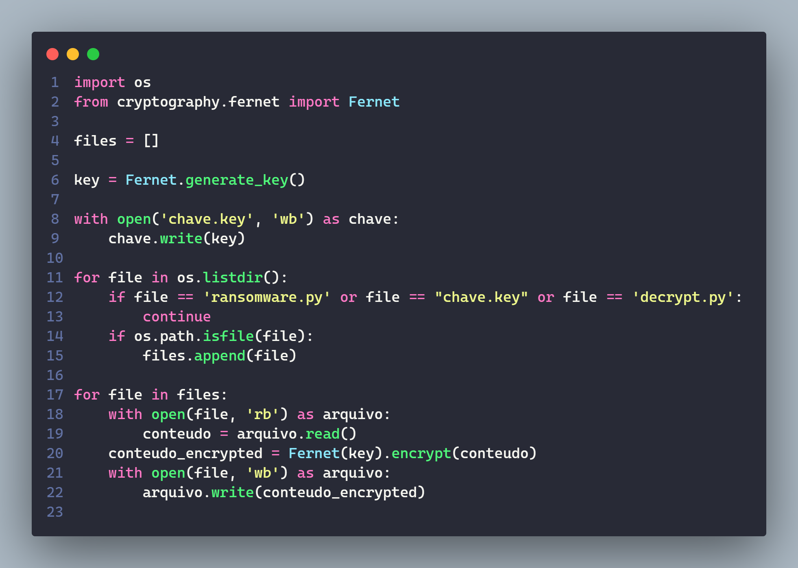

<h1 align="center"><b>Ransomware com Python</b>🐍</h1>

Criando um ransomware usando a linguagem Python para criptografia de arquivos.

## ❗ Pre reqs

Para criar nosso ransomware (malware/virus), é necessário ter o Python instalado em sua versão 3.6 ou acima de preferência de acordo com os mantenedores da lib.

**1 - Atualizar o pip**:

```
python.exe -m pip install --upgrade pip
```

**2 - Habilitar e ativar o ambiente virtual**:

Primeiro acessando a pasta malware, onde estará nosso ambiente virtual

```SH
cd malware/
```

No Windows:

```SH
python -m venv venv
. venv/Scripts/activate
```

No Linux:

```SH
python3 -m venv venv
. venv/bin/activate
```

## 📚 Biblioteca Fernet

Fernet - garante que uma mensagem criptografada não pode ser manipulada ou lida sem uma chave. Fernet é uma implementação de criptografia autenticada simétrica (também conhecida como "chave secreta"). Fernet também suporta implementação de rotação de chaves via MultiFernet

Para instalar:

```SH
pip install cryptography
```

## 👨‍💻 Comando cat X Get-Content

Ambos comandos são usados para exibir o conteúdo interno de arquivos, com a diferença de S.Os, onde o comando `cat` é usado no Linux e o comando `Get-Content` é usado no Windows (ambos usado no terminais do SO). Provavelmente o comando cat pode funcionar em computadores com MacOS

No Linux:

```SH
cat text1.txt
```

No Windows:

```SH
Get-Content text1.txt
```

## ✅ Projeto finalizado

O benefício da lingugame Python é um código mais limpo, com uma sintaxe muito simples e de alto nível.

**ransomware.py**

<p align="center">
  
</p>

**decrypt.py**

<p align="center">
  
</p>
